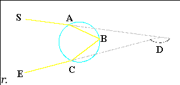

# 1

Computer Vision(CV) is the scientific field that studies how computers can be used to capture, process and identify information from real world, using images.

CV is very important because, humans rely a lot on their  vision(half of the brain).

Recently photos have become really popular, mostly digital. Therefore, there is a lot of data that can be used for numerous applications.

Some applications are:

1. Healthcare:
   In Healthcare there can be a plethora of use cases for CV, one of the most important are Tumor detection. By using CV on MRI scans, the doctors are able to identify and diagnose a patient faster. I believe this is the most important one because the human life in priceless, and cannot be put above anything else.

2. Industrial application:
   A lot of production lines can benefit from CV. Being able to automatically detect errors directly during the manufacturing process means that they can be easily rectified. Before it has reached the end user.

3. Autonomous driving:
   CV can be used to automate the process of driving. The task of driving the car can be partially automated. This not only can increase the safety of driving, but can also replace jobs such as truck drivers.

# 2

Class 0: {3,3,4,5}:
$\sigma_0^2 = 0.68$
$p_1 = 4$

Class 1: {10,10,10,10, 200}
$\sigma_1^2 = 5776.0$
$p_2=5$

Minimize
$p_1*\sigma_0^2 + p_2*\sigma_1^2$

# 3

- A: Diffused lighting;
- B: Reflection;
- C: Angle of refraction;
- D: Diffusion;
- E: Refraction.

# 4

The rainbow is a meteorological phenomena, that is comprised of reflection, refraction and dispersion of light. The light coming from the sun(S) enter the water droplet at point(A) where refraction occurs. Then the light gets reflected at point(B). At point (C) the light gets refracted again. The white ray of light is dispersed into multiple wavelengths at the first refraction point(A).

{width=40%}

[Source Link](https://web.archive.org/web/20130818203028/http://eo.ucar.edu/rainbows/)

# 5

Depth of field is the distance between the farthest and the nearest objects, where the resulting image can still be considered sharp.

The DoF is given by the circle of confusion, focal length, f-number and the distance to the subject. The f-number represents the ratio between the focal length and the diameter of the effective aperture. The aperture can the adjusted to handle objects at far and near distance. With a small aperture, the objects at a distance are focused, respectively, with a big aperture, the objects that are close are focused.

[Source](https://en.wikipedia.org/wiki/Depth_of_field)
[Source](https://en.wikipedia.org/wiki/F-number)

# 6

In a training scenario, the train and validation accuracies(or the loss) are plotted together. If the train accuracy is really high and the validation accuracy is low, creating a gap (generalization gap), it can be concluded that overfitting occurs. Meaning that our model cannot generalize to new data. The test data in this case is not considered because, it's a training scenario and this data is used in the final stage to evaluate the model on unseen data.

# 7

- Dense 1: 96 * 96 * 3 * 256 = 7077888
- Dense 2: 256 * 64 = 16384
- Dense 3: 10 * 64 = 640

  Total: 7094912

# 8

Convolution:

$$
\begin{bmatrix}
-2 & -1 &  -3\\
0  & -3 & -3 \\
8  & 3 & 4
\end{bmatrix}
$$

Transposed Convolution:

$$
\begin{bmatrix}
 0 & 1 & 0&  -2&0\\
 -2& 1 & -4& 0& -2\\
 1 & -1& 1&  0& 0 \\
 1 &  3& 4 & 2 &4  \\
 - &  1& 3 & 2 & 0
\end{bmatrix}
$$

# 9

- Input (96x96x1) no params
- Conv 1:  3 * 3 * 1 * 32 = 288
  output: 94x94x32
- Max pool (2x2, stride 3) no params
  output: 31x31x32
- Conv 2:  3 * 3 * 32 * 16 = 4608
  output: 29x29x16
- Max pool: (2x2, stride 2) no params
  output: 15x15x16
- Conv 3:  3 * 3 * 16 * 32 = 6408
  output: 12x12x32
- Max pool:  (2x2, stride 2) no params
  output: 6x6x32
- Flatten (1152)
- Dense 1: 128 * 1152 = 147456
- Dense 2: 2 * 128 = 256

Total: 157,216

# 10

In a CNN the receptive field can be increased by:

- Increasing the size of the kernel that is used in the Convolutions in the architecture -> more information from the input image can reach the later neurons.

- Decrease the strides -> by using strides, some of the information is skipped, and therefore less information reaches the later neurons

