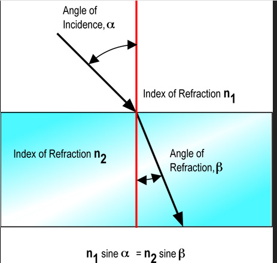
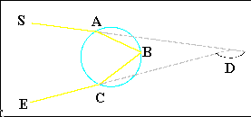
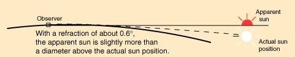
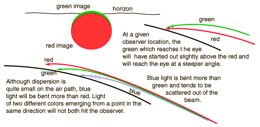
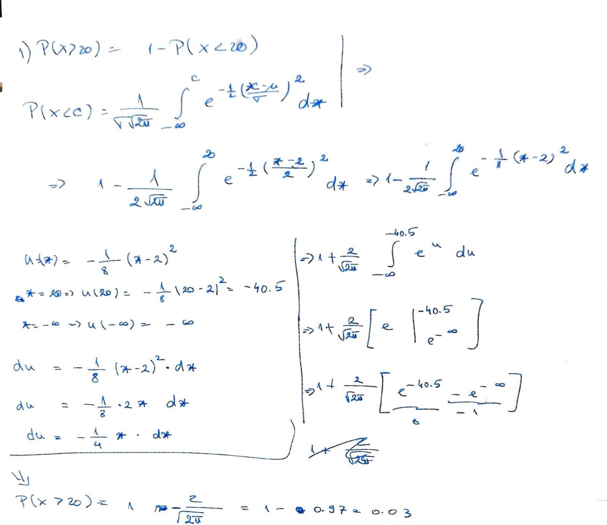

# 1

Computer Vision(CV) is the scientific field that studies how computers can be used to capture, process and identify information from real world, using images.

CV is very important because, humans rely a lot on their  vision. Therefore, a lot of tasks that use vision could be automated.

In my opinion these are the 3 most important CV applications:

1. Healthcare:
   In Healthcare there can be a plethora of use cases for CV, one of the most important are Tumor detection. By using CV on MRI scans, the doctors are able to identify and diagnose a patient faster. I believe this is the most important one because the human life in priceless, and cannot be put above anything else.

2. Agricultural:
   Identifying potential diseases in plants. This can prevent the loss of entire fields. Due to the fact that the human population is on the rise, the need for food is increasing as well, by using advanced technology the demand can be sustained.

3. Autonomous driving:
   CV can be used to automate the process of driving. The task of driving the car can be partially automated. This not only can reduce the number of car crashed, but can also replace jobs such as truck drivers.


# 2

Light refraction is the change in direction of a light wave passing from one medium to another.

The angle of reflection can be different than the angle of incidence.
The interaction between the two angles is described by the Snell's Law.

$$ n_1 * \sin(\alpha) = n_2 * \sin(\beta)$$

Where $n_{1,2}$ is the refractive index, \alpha is the angle of incidence and \beta is the angle of reflection.

{width=30%}

The angle is different when the Refractive index of the two media are different. The refractive index depends on the medium and it describes how fast the light travels trough the material. [Source Link](https://en.wikipedia.org/wiki/Refractive_index)


# 3

The rainbow is a meteorological phenomena, that is comprised of reflection, refraction and dispersion of light. The light coming from the sun(S) enter the water droplet at point(A) where refraction occurs. Then the light gets reflected at point(B). At point (C) the light gets refracted again. The white ray of light is dispersed into multiple wavelengths at the first refraction point(A).

{width=40%}

[Source Link](https://web.archive.org/web/20130818203028/http://eo.ucar.edu/rainbows/)

One of the phenomena in the sunset, is the fact that the position of the sun is perceived differently. The altered position is cause by the refraction of sunlight trough the atmosphere.

.

Another common phenomena is the red color of the sun. This is due to the fact that the other colors of higher wavelengths get scattered away, and only the shortest wavelength (red) gets attenuated the least.



[Source Link](https://scienceblogs.com/startswithabang/2013/02/13/the-physics-of-sunsets)


# 6

In order to represent the pixel values [0...58], the minimum number of bits is 6. (2^6 = 64 no loss, 2^5 = 32 loss)

# 7

Considering 99% of the values in the  $[\mu - 3* \sigma$, $\mu + 3* \sigma]$ results that 100 doesn't belong in  [-6, 12]


$$ P(X \ge 20) = 1 - P(X < 20)$$



\newpage


```{python}
import statistics

functions = [statistics.mean, statistics.median, min, max]

a = [1, 3, 1, 5, 100, 2, 4, 2, 1]

def filter(array, window_size, function):
    result = []
    for i in range(0, len(array) - window_size + 1):
        m = round(function(array[i:i+window_size]),2)
        result.append(m)
    return result

for f in functions:
    print(f.__name__, " = " ,filter(a, 3, f))

```

The filtering is done without padding.


# 8


In the case of salt and pepper noise, the median filtering is proffered. The high and low values which can be treated as outliers, therefore the median filtering is ignoring the extreme values. The Gaussian filtering will treat the extreme values as part of the real image.

